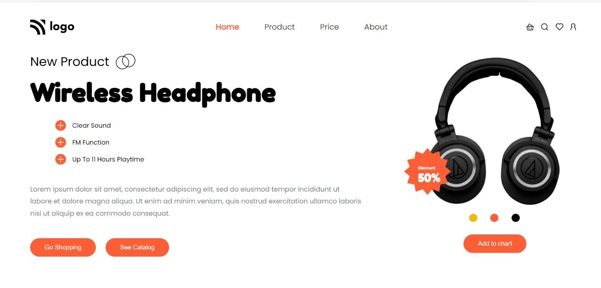

# Assignment-7 
## (Product Home Page) 

> In this project, I have used HTML (the Hypertext Markup Language) and CSS (Cascading Style Sheets), which are two of the core technologies for building Web pages. It is a responsive page.

### As a result of this project, I learn the following:
[LIVE-LINK](https://projectproductpage.netlify.app/)

- [x] learned more about Font Awesome/icon
- [x] To align elements horizontally, I used display flex
- [x] used z-index
- [x] familier with button property

#### The duration of the project:4 hour